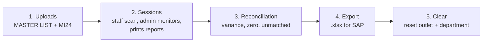

# StockTake Admin

The admin console for the StockTake app. Staff count stock on their phones with the scanner page (`index.html`). This admin page is where supervisors prepare the count, watch it live, check it against SAP, export the result and clean up afterwards.

It is a static site (plain HTML, CSS and JavaScript, no build step) hosted on GitHub Pages. All data lives in Supabase.

- [What it does](#what-it-does)
- [Quick start](#quick-start)
- [The stocktake workflow](#the-stocktake-workflow)
- [Page-by-page guide](#page-by-page-guide)
- [Safety rules built into the admin](#safety-rules-built-into-the-admin)
- [File map](#file-map)
- [How the code is organised](#how-the-code-is-organised)
- [Database](#database)
- [File formats (MASTER LIST and MI24)](#file-formats-master-list-and-mi24)
- [Printing](#printing)
- [Deploying and updating](#deploying-and-updating)
- [Testing checklist](#testing-checklist)
- [Troubleshooting](#troubleshooting)
- [Security notes](#security-notes)
- [Changelog](CHANGELOG.md)

---

## What it does

| Area | Purpose |
| --- | --- |
| **Dashboard** | Whole-outlet overview, a "needs attention" list, progress per department and a shared stocktake checklist |
| **Uploads** | Load the MASTER LIST (product reference data) and the MI24 book list (what SAP expects) |
| **Sessions** | Watch gondola counts live, correct or delete scanned items, print the A4 Zone Count Report |
| **Reconciliation** | Compare counted quantity with the MI24 book quantity, find variances, zero counts and unmatched scans |
| **Export** | Download the `.xlsx` that is uploaded to SAP |
| **Clear** | Delete one outlet and department's stocktake data after the count is finished |

Two outlets are currently set up: `1015 - SHPL` and `1008 - SHBN`. Everything in the admin works on **one selected outlet at a time**.

## Quick start

1. Open `admin.html` on the site (for example `https://<user>.github.io/<repo>/admin.html`).
2. Enter the admin PIN. It is asked on every page load.
3. Pick the **outlet** in the top bar. The choice is remembered on that browser.
4. Pick a **department** in the top bar when a page needs one. Pages that need one say so.
5. Follow the sidebar from top to bottom: Uploads, Sessions, Reconciliation, Export, Clear.

Use it on a desktop browser. The layout is not designed for phones.

---

## The stocktake workflow



1. **Uploads.** Load the MASTER LIST for the department (shared by all outlets), then the MI24 book list for this outlet and department.
2. **Sessions.** Staff scan with the scanner page. Watch gondolas come in, fix wrong counts, print the report for each finished gondola.
3. **Reconciliation.** Review variances, zero counts and items scanned that are not in the book list.
4. **Export.** Download the SAP upload file.
5. **Clear.** Once the export is safe, clear the outlet and department so the next count starts fresh.

---

## Page-by-page guide

### Top bar and sidebar

- **Outlet** and **Department** are chosen once in the top bar and apply to every page. The sidebar also shows what you are working on.
- Both pickers are **locked while something is being saved** (an upload, a clear, a checklist tick), so the scope cannot change halfway through a write. Leaving the page during a save asks for confirmation.
- The **Live** indicator appears on pages that refresh themselves (Dashboard, Sessions, Reconciliation). They refresh every 30 seconds. **Pause** stops it, **Resume** restarts it.
- The sidebar shows a small badge when something needs attention (for example unmatched scans, or items on the dashboard's attention list).

### Dashboard

Shows the **whole selected outlet** across all departments.

- **Tiles:** gondolas finished, waiting to be printed, items scanned, MI24 rows, unmatched scans.
- **Needs attention:** each line names the department and has a button that jumps to the right page. It raises:
  - scans exist but no MI24 book list is loaded,
  - gondolas still in progress,
  - finished gondolas not printed,
  - scanned items not in the MI24 book list,
  - manual checklist ticks that the data contradicts.
- **Progress by department:** one row per department with MI24 rows, gondolas done, printed, six progress dots and a status. Click a row to select that department and see its checklist.
- **Checklist** for the chosen department (see below).

#### The checklist

One checklist per **outlet and department**, six steps in order:

| # | Step | How it is set |
| --- | --- | --- |
| 1 | MASTER LIST loaded | **Manual check required** |
| 2 | MI24 book list loaded | **Checked automatically** (MI24 rows exist for this outlet and department) |
| 3 | All gondolas finished | **Checked automatically** (at least one gondola and none in progress) |
| 4 | All gondola reports printed | **Checked automatically** (every finished gondola has a print stamp) |
| 5 | Reconciliation reviewed | **Manual check required** |
| 6 | Exported for SAP | **Manual check required** |

- Manual ticks are stored in Supabase (`checklist_progress`), so **every supervisor sees the same state**. Another supervisor's tick appears on the next refresh.
- A manual tick that the data contradicts is **allowed but flagged**, for example "Exported" while gondolas are still in progress, or "Exported" before "Reconciliation reviewed".
- **Clear resets the checklist** of the cleared outlet and department. Other departments and the other outlet keep theirs.
- If the `checklist_progress` table is missing, the rest of the dashboard still works and a message says that ticks will not be saved.

### Uploads

Three parts: MASTER LIST, MI24 book list, and a "Data on file" table.

#### 1. MASTER LIST (shared)

- **Shared by every outlet.** Products have no outlet, so updating the MASTER LIST changes product details for all outlets. A warning on the page says so.
- One department per file. Choose the department for the file, or create a new one.
- Existing barcodes **update in place**, new barcodes are **added** (upsert on `barcode`, saved in parts of 500).
- The page shows a preview of the first rows, how many are new and how many update, and a log while saving.
- Nothing is deleted from the product list.

#### 2. MI24 book list (per outlet and department)

- Needs an outlet **and** a department selected in the top bar.
- Pick the **count date**. It is applied to every row and stored as `dd.mm.yyyy`.
- Saving **replaces** the MI24 rows for this outlet and department only. Other departments and the other outlet are not touched.
- The old rows are removed first, then the new rows are saved in parts of 500. If a part fails, the log says the data is incomplete and asks you to upload the file again.
- A book quantity of `0` is kept as `0`. A blank book quantity is stored as empty.

#### How columns are found

Columns are matched by **header name**, not by position, so a different column order in the SAP file does not break the import.

- The page shows a **column-mapping panel**: each required field and the column it picked, with a dropdown to correct it. Fields marked `*` are required.
- A sample of the first rows "as they will be saved" appears **before** you save anything.
- **Blockers** stop the upload button (for example a required column not found, or a UOM column that is mostly numbers, which would mean Cost was picked instead of the unit).
- **Warnings** do not stop the upload (for example rows skipped because they have no barcode).
- MASTER LIST never falls back to fixed column positions. MI24 may fall back to the old fixed layout, and says so with a warning.
- Repeated barcodes in the MASTER LIST that are identical copies (the same item listed for two plants) are saved once, with an information note. Repeated barcodes with **conflicting** details raise a warning.
- The MASTER LIST reads the **Sales unit** column as the UOM. The Base Unit of Measure column is not used for UOM, because it is always `EA`.

See [File formats](#file-formats-master-list-and-mi24) for the exact headers.

#### 3. Data on file

Per department for the selected outlet: MASTER item count, **when the MASTER LIST was last updated**, MI24 rows, MI24 count date, number of gondolas and a status (MI24 loaded, scans but no MI24, nothing loaded). The same "MASTER LIST last updated" line also shows under the department picker of the MASTER LIST upload.

### Sessions

One row per gondola for the selected outlet (and department if chosen).

- **Search** by gondola ID, staff name or department.
- **Filter** by status (all, in progress, done, stale) and by printed or not printed. **Stale** means in progress for more than 6 hours.
- **Sort** by clicking a column header.
- **Auto-refresh** every 30 seconds (pausable).
- **Click a row** to open the detail panel: every scanned item with quantity. You can **edit a quantity**, **delete an item**, reload the items, print, or **delete the whole gondola**.
- **Delete gondola** (in the detail panel) removes exactly one gondola and its scanned items, after a confirmation that names it. Use it for a gondola ID started under the wrong department: the ID is unique per outlet, so a wrong one blocks that ID until it is deleted. The ID can be used again straight away. A gondola that is still in progress gets an extra warning in the confirmation, because staff may still be counting on it. Only that one gondola of the selected outlet is touched.
- Counted quantities everywhere are in **base units**: `qty × numerator`.
- **Print** button on every row. It opens a preview first, then prints, then stamps the gondola as printed. See [Printing](#printing).

### Reconciliation

Live comparison for the selected outlet (and department if chosen).

- Columns: material, description, UOM, **book qty**, **counted qty**, **variance** (counted minus book), status, **barcode** and **gondola trace**.
- **Gondola trace:** for every material, a summary of which gondolas it was scanned in, for example `SM1: 5 (2 scans), SM2: 4`. The **Trace** button on the row opens a pop-up with every individual scan (gondola, barcode, quantity, time) and a total to compare with the counted quantity. This reads the database function `department_scan_trace`. If it cannot be read, the reconciliation still shows and a notice explains that only the trace and barcode columns are affected.
- **Barcode:** every distinct barcode that was actually scanned for the material (so an EA barcode and a carton barcode both show if both were scanned). Materials with no scans show their numerator-1 barcode from the MASTER LIST.
- **SAP columns** button: shows or hides the SAP document columns (Phys. Inventory Doc., Item, Batch, Plant, Storage location, Special Stock, Count Date). They are hidden by default to keep the table compact.
- **Export to Excel:** downloads what is on screen, with the current search and filter and in the current sort order. The reconciliation file has 16 columns in the SAP working-paper order: Phys. Inventory Doc., Item, Material, Material Description, Batch, Plant, Storage location, Special Stock, Count Date, Qty Counted, Base Unit of Measure, Book Quantity, Zero Count, Var Qty, Barcode, Gondola Trace (a Department column is added when all departments are shown). On the Unmatched chip it exports the unmatched list instead. File name: `Reconciliation_<outlet>_<department>_<yyyy-mm-dd>.xlsx`.
- A banner warns when **all book quantities are empty or 0** for a department. That usually means the MI24 was uploaded before SAP posting, so Variance simply equals the counted quantity and is not meaningful until the MI24 is re-uploaded with real book quantities.
- Status: **Matches**, **Variance**, or **Zero count** (nothing counted).
- Filter chips: **All lines**, **Variance**, **Zero count**, **Unmatched**. **Unmatched** lists items that were scanned but are not in the MI24 book list.
- Search by material, description, barcode or gondola ID, and sort by any column.
- Large lists are drawn 300 lines at a time ("Show more" / "Show all"). The totals always cover every filtered line.
- A banner warns when a department has scans but no MI24 book list, which makes everything scanned there show as unmatched.
- Corrections made in Sessions show here straight away.

### Export

Produces the file that is uploaded to SAP, for the selected outlet and department.

- Shows total lines, total quantity counted, zero-count lines and a preview.
- Warns about gondolas still in progress (what is scanned so far is in the file, later scans are not) and about scanned items not in the MI24 list (SAP only receives MI24 lines, so those are not in the file).
- **Download re-checks the latest data first.** The page re-reads the data line by line right before making the file. If any count changed since the page was loaded, **no file is made**, the page shows what changed and the new numbers, and you press Download again. If the re-check fails (for example the connection drops), nothing is downloaded.
- File name: `SAP_Export_<outlet>_<department>_<yyyy-mm-dd>.xlsx`, sheet name `SAP Upload`.
- Thirteen columns, in this order: Phys. Inventory Doc., Item, Material, Material Description, Batch, Plant, Storage location, Special Stock, Count Date, Qty Counted, Base Unit of Measure, Book Quantity, Zero Count.

### Clear

Deletes the stocktake data for **one outlet and one department**.

- Shows what will be deleted (gondola sessions, scanned items, MI24 rows) and warns about gondolas still in progress and finished gondolas that were never printed.
- Offers a link to Export first. Cleared data cannot be exported or recovered.
- To confirm, type the **4-character code** shown on the page. The code uses letters and digits without `0`, `O`, `1` and `I`. A code works **once**; a new one is generated after each use.
- Deletes the gondola sessions (their scanned items go with them), then the MI24 rows, then resets that department's checklist.
- Before and after, it counts the rows in **other outlets and other departments** and reports whether they stayed unchanged. If those numbers ever go down, it shows a warning.
- **MASTER LIST products are never touched.**
- A second panel, **Departments still holding data**, lists every department of the selected outlet that still has gondolas or MI24 rows (with the counts), so nothing is forgotten after a count. **Select** switches to that department. The list refreshes after each Clear. Other outlets are not shown.

---

## Safety rules built into the admin

1. **Everything is limited to the selected outlet.** All database access goes through one helper (`Scoped`) that adds the outlet to every read and write. A change without an extra filter is refused. A row tagged for a different outlet is refused. Clearing, uploading, ticking or printing in one outlet cannot touch the other.
2. **Scan items are checked through their gondola.** `scan_items` has no outlet column, so before any scan item is read, changed or deleted, the admin first proves the gondola belongs to the selected outlet.
3. **The scope is locked during writes.** Outlet and department pickers are disabled while a save runs, and leaving the page asks for confirmation.
4. **Stale data is dropped.** After an upload, clear or similar change, the other pages forget what they loaded and re-read it.
5. **Uploads show what they will do before saving**: column mapping, sample rows, blockers and warnings.
6. **Export re-reads before downloading** and refuses to make a file from data that has changed.
7. **Clear needs a typed one-time code** and verifies afterwards that nothing else changed.
8. **Large lists are fetched in pages.** Supabase returns at most 1,000 rows per request and cuts the rest silently, so every list that can grow is fetched page by page in a stable order.

---

## File map

All files live next to each other in the same folder.

| File | Role |
| --- | --- |
| `admin.html` | Page shell: PIN gate, sidebar, top bar, drawer, modal, toasts, print area. Loads the scripts below |
| `admin.css` | All styling, including light and dark themes and the A4 print rules |
| `admin.js` | Core: configuration, PIN gate, navigation, scope bar, `Scoped` database helper, live refresh, toasts, section registry |
| `admin-dashboard.js` | Dashboard and the shared checklist |
| `admin-uploads.js` | MASTER LIST and MI24 uploads, column detection, "Data on file" |
| `admin-sessions.js` | Gondola list, detail panel, print preview and the A4 report |
| `admin-recon.js` | Reconciliation |
| `admin-export.js` | Export, including the re-check before download |
| `admin-clear.js` | Clear |
| `index.html` | The staff scanner page (separate from the admin) |

Script load order matters: `admin.js` first (it creates the shared object), then the section files. The `?v=` numbers on the script and style tags in `admin.html` are cache-busting versions. **Raise the number of any file you change**, so browsers fetch the new file.

External libraries (loaded from CDNs in `admin.html`): SheetJS (reading and writing `.xlsx`) and `supabase-js`.

---

## How the code is organised

Each file is a self-contained IIFE. `admin.js` creates `window.StockTakeAdmin` (called `App` in the code) and every section plugs into it.

```text
admin.js  ->  App = window.StockTakeAdmin
                |-- App.register(id, { render(root), refresh(), reset(), closeOverlays() })
                |-- App.Scoped    outlet-guarded database helper
                |-- App.fetchAllPages(makeQuery)
                |-- App.go(section), App.setDept(id)
                |-- App.setBusy(on), App.invalidateData(exceptId)
                |-- App.toast, App.esc, App.icon, App.pageHead
                |-- App.outletId, App.deptId, App.outlets, App.depts
                `-- App.onCleared(outletId, deptId)    hook set by the dashboard
```

**Sections.** Each section file calls `App.register("name", {...})`:

- `render(root)` draws the page into `root`.
- `refresh()` (optional) is called every 30 seconds while the page is open. Pages without it do not show the Live indicator.
- `reset()` forgets everything loaded. It is called when the outlet changes and after data-changing actions in other sections.
- `closeOverlays()` (optional) closes that section's panels.

To add a new section: create `admin-something.js`, register it, add it to the `NAV` list in `admin.js`, and add its script tag to `admin.html`.

**`Scoped` helper.** Use it for every outlet-owned table:

| Method | What it does |
| --- | --- |
| `Scoped.select(table, cols, opts)` | Adds `outlet_id = selected outlet` |
| `Scoped.insert(table, rows)` | Stamps `outlet_id` on every row, refuses rows for another outlet |
| `Scoped.upsert(table, rows, onConflict)` | Same stamping, then upsert |
| `Scoped.update(table, values, filters)` | Needs at least one extra filter, always adds the outlet |
| `Scoped.remove(table, filters)` | Needs at least one extra filter, always adds the outlet |
| `Scoped.assertSession / scanItems / updateScanQty / deleteScanItem` | Scan-item access proven through the gondola's outlet |

Only reference data without an outlet (`departments`, `products`) is read or written without `Scoped`.

**Why plain JavaScript and no build step.** The site is deployed by uploading files to GitHub Pages. Nothing needs installing or compiling, and any file can be edited directly.

---

## Database

Supabase (PostgreSQL). The admin and the scanner use the public (anon) key with row level security.

### Tables

Column lists below are what the code reads and writes. Check them against your project with `select table_name, column_name, data_type from information_schema.columns where table_schema = 'public' order by 1, ordinal_position;`.

| Table | Purpose | Columns used by the app |
| --- | --- | --- |
| `outlets` | The outlets | `id`, `name` (for example `1015 - SHPL`) |
| `departments` | Shared department list | `id`, `name` |
| `products` | MASTER LIST, shared by all outlets | `barcode` (unique, upsert key), `material`, `description`, `material_group`, `uom`, `numerator`, `department_id`, `updated_at` |
| `gondola_sessions` | One counting session per gondola | `id`, `outlet_id`, `gondola_id`, `department_id`, `staff_name`, `status`, `started_at`, `ended_at`, `printed_at` |
| `scan_items` | Scanned lines | `id`, `session_id`, `barcode`, `material`, `description`, `uom`, `numerator`, `qty`, `request_id`, `created_at`, `updated_at` |
| `sap_uploads` | MI24 book list, per outlet and department | `id`, `outlet_id`, `department_id`, `phys_inventory_doc`, `item`, `material`, `description`, `batch`, `plant`, `storage_location`, `special_stock`, `count_date`, `base_uom`, `book_quantity` |
| `checklist_progress` | Manual checklist ticks, per outlet and department | `outlet_id`, `department_id`, `step`, `done`, `updated_at` |

### Constraints that matter

| Constraint | Meaning |
| --- | --- |
| `gondola_sessions` unique on `(outlet_id, gondola_id)` | The same gondola ID can exist once per outlet, so SM1 in 1015 and SM1 in 1008 are different gondolas |
| `gondola_sessions.status` check | Only `in_progress` or `done` |
| `scan_items.session_id` foreign key **on delete cascade** | Deleting a gondola deletes its scanned items |
| `scan_items.request_id` unique | Makes a retried save safe: the same save cannot create a duplicate |
| `scan_items.qty >= 0` | No negative counts |
| Foreign keys from `gondola_sessions` and `sap_uploads` to `outlets` and `departments` | No orphan rows |

### Views

All views group or join on `outlet_id`, so outlets never mix.

| View | What it gives |
| --- | --- |
| `session_summary` | One row per gondola with department and outlet names and `item_count` |
| `reconciliation` | One row per MI24 line with `qty_counted` and a `zero_count` flag |
| `sap_export` | Same as reconciliation plus all the SAP columns, used for the export file |
| `unmatched_scans` | Scanned materials that are not in the MI24 list, by outlet and department |

**Counted quantity** is always `sum(qty × numerator)` per outlet, department and material, so it is in base units.

### Database function used by the admin

| Function | Used by | Notes |
| --- | --- | --- |
| `department_scan_trace(p_department_id, p_outlet_id)` | Reconciliation, Gondola trace | Returns one row per scan with at least `material`, `gondola_id`, `qty`, `scanned_at` and `barcode`. The admin always passes the selected outlet, and refuses any row that comes back tagged with a different outlet or department. The function was created earlier and is not part of this repository's files; keep it when rebuilding the database |

### Checklist table (SQL)

Run once in the Supabase SQL editor. This is the shape the dashboard expects.

```sql
create table if not exists public.checklist_progress (
  outlet_id     bigint      not null references public.outlets(id),
  department_id bigint      not null references public.departments(id),
  step          text        not null check (step in ('master', 'review', 'export')),
  done          boolean     not null default false,
  updated_at    timestamptz not null default now(),
  primary key (outlet_id, department_id, step)
);

alter table public.checklist_progress enable row level security;

create policy "anon can read checklist_progress"   on public.checklist_progress for select to anon using (true);
create policy "anon can insert checklist_progress" on public.checklist_progress for insert to anon with check (true);
create policy "anon can update checklist_progress" on public.checklist_progress for update to anon using (true) with check (true);
create policy "anon can delete checklist_progress" on public.checklist_progress for delete to anon using (true);
```

Only the three manual steps are stored. The three automatic steps are worked out from live data every time.

If your existing table differs from this, keep your version. The app only needs the columns and the primary key above, and a delete policy (Clear uses it).

### Row level security

Row level security is on, with policies that give the anon role read, insert, update and delete on the tables the app uses. That means **the admin page is the only outlet guard**. See [Security notes](#security-notes).

---

## File formats (MASTER LIST and MI24)

Both are SAP exports in `.xlsx` or `.xls`, with the header in the first row of the first sheet.

### MASTER LIST

| Field | Accepted header (examples) | Notes |
| --- | --- | --- |
| Barcode * | `EAN/UPC`, `Barcode`, `GTIN` | Rows with no barcode are skipped |
| Material * | `Material`, `Material Number` | |
| Description * | `Material Description`, `Description` | |
| Material group | `Material Group` | Optional |
| UOM * | `Sales unit` (first choice), then alternative-unit names | **Not** `Base Unit of Measure` unless nothing else exists |
| Numerator * | `Numerator`, `Numerator for ...` | Quantity in base units per UOM |

\* required

### MI24 book list

| Field | Accepted header (examples) | Notes |
| --- | --- | --- |
| Phys. inventory doc. * | `Phys. Inventory Doc.` | |
| Item | `Item` | |
| Material * | `Material` | One line per material |
| Description * | `Material Description` | |
| Batch, Plant, Storage location, Special stock | `Batch`, `Plant`, `Storage location`, `Special Stock` | Optional |
| Base unit of measure | `Base Unit of Measure` | Optional |
| Book quantity * | `Book Quantity` | Blank is stored as empty, `0` as 0 |

The exact alias lists are the `MASTER_FIELDS` and `SAP_FIELDS` arrays at the top of `admin-uploads.js`. To support a new header name, add it to the `alias` list of that field.

---

## Printing

The **Zone Count Report** is printed from the Sessions page on **A4**.

- Click **Print** on any gondola row (or in the detail panel). A preview opens first. **Print and mark as printed** opens the browser's print dialog and stamps the gondola.
- The report lists the scanned items with quantities.
- A **Verified by** box appears at the bottom of the **last page only**.
- Each page footer carries the gondola ID and page number, for example `SM1 · Page 1 of 2`, so mixed-up pages can still be told apart.
- The table header is **not repeated** on every page.
- The first page holds up to 30 item rows, following pages up to 35, with space kept for the Verified by box on the last page.
- Printing stamps `printed_at` on that gondola only. The "Printed" status in Sessions, the "Waiting to be printed" tile and checklist step 4 all use this stamp.

---

## Deploying and updating

**First deploy or full update**

1. Upload all files in the [file map](#file-map) to the same folder of the GitHub Pages site.
2. Make sure `checklist_progress` exists in Supabase.
3. Hard-refresh the page once (Ctrl+F5).

**Changing one file**

1. Edit the file.
2. In `admin.html`, raise the `?v=` number on that file's tag so browsers do not use the cached copy.
3. Upload both files.

**Configuration** is at the top of `admin.js`: the Supabase URL and public key, the PIN, the key used to remember the outlet and the refresh interval (30 seconds).

**Adding an outlet or department**

- A new **outlet** is a row in `outlets`. It appears in the outlet picker automatically.
- A new **department** can be created while uploading a MASTER LIST ("New department"), or added to `departments`.
- The staff scanner is locked to one outlet by a constant at the top of its page (`OUTLET_CODE`), so each outlet has its own copy of `index.html`.

---

## Testing checklist

Run through this after any change, using test data or a quiet period.

**Outlet isolation (most important)**

- [ ] With data in both outlets, switch outlets and confirm the numbers on Dashboard, Sessions, Reconciliation and Export change.
- [ ] Use the **same gondola ID** in both outlets. Printing one must not stamp the other.
- [ ] Clear a department in one outlet and confirm the other outlet's sessions, MI24 rows and checklist ticks are unchanged.
- [ ] Upload MI24 for one outlet and confirm the other outlet's MI24 rows are unchanged.

**Uploads**

- [ ] Upload the MASTER LIST: mapping panel shows every field set, sample rows look right, UOM comes from Sales unit.
- [ ] Upload MI24: row count matches the file, count date is `dd.mm.yyyy`.
- [ ] A file with a missing required column is blocked.

**Sessions and print**

- [ ] Correct a quantity and delete an item, then check Reconciliation.
- [ ] Print a long gondola (more than 30 items): page numbers read `ID · Page n of N`, Verified by only on the last page.
- [ ] After printing, the row shows Printed.

**Reconciliation extras**

- [ ] The Trace button lists every scan of a material, and the gondola summary matches it.
- [ ] Export to Excel has the 16 columns, follows the search and filter, and contains only the selected outlet.
- [ ] A department whose book quantities are all 0 shows the warning banner.

**Delete gondola**

- [ ] Cancel keeps the gondola. Confirm deletes only that gondola, and the same ID in the other outlet is untouched.

**Export**

- [ ] Download works and has 13 columns.
- [ ] Change a count in another tab after opening Export, then press Download: no file, a notice appears.

**Clear**

- [ ] Wrong code keeps the button disabled. The right code clears only the chosen outlet and department.
- [ ] The result says other outlets and departments are unchanged.

**Dashboard**

- [ ] A manual tick appears for another supervisor after the next refresh.
- [ ] Clear resets that department's checklist.

---

## Troubleshooting

| Problem | Cause and fix |
| --- | --- |
| A section says "This section did not load" | One of the script files is missing or not uploaded. Upload all files from the file map next to `admin.html` and reload |
| Old behaviour after an update | The browser cached an old file. Raise the `?v=` number in `admin.html`, or hard-refresh with Ctrl+F5 |
| "Column not found" on upload | The header name is not in the alias list. Pick the column in the mapping panel, or add the name to `admin-uploads.js` |
| UOM upload blocked: "mostly numbers" | The UOM column picked is a numeric column such as Cost. Choose the right column in the mapping panel |
| MASTER LIST says "8 rows with no barcode are skipped" | Those rows have an empty EAN/UPC. They cannot be scanned, so they are left out |
| Every barcode appears twice in the MASTER LIST | The same item is listed for two plants. Identical copies are saved once |
| Download says nothing was downloaded and counts changed | Counts changed after the page loaded (staff are still scanning, or a correction was made). Check the new numbers and press Download again |
| Export says there is no MI24 data | Nothing is loaded for this outlet and department. Upload the MI24 first |
| Reconciliation shows everything as unmatched | The department has scans but no MI24 book list for this outlet. Upload the MI24 |
| Checklist ticks are not saved | The `checklist_progress` table is missing or has no policies. Run the SQL above |
| Lists seem to stop at 1,000 rows | They should not: lists are fetched in pages. If it happens, a new query was added without `fetchAllPages` and a stable `order` |
| Cannot change outlet | A save is still running. Wait for it to finish |
| Clear finished but "something is left" | Part of the delete failed. Run Clear again with the new code |

---

## Security notes

Read this before treating the admin as secure.

- **The PIN is checked in the browser.** It keeps casual visitors out but is not real authentication. Anyone who can read `admin.js` can read the PIN. Do not put the PIN or any real secret in this README, in commit messages or in issues.
- **The Supabase key in the page is the public (anon) key.** That is normal for a browser app, but it means the database rules are the real protection. Today the policies allow the anon role to read, insert, update and delete on the stocktake tables, so **the outlet separation is enforced by the admin page, not by the database**. Someone with the key could call the API directly.
- The page has a `noindex` tag so search engines skip it, and the sidebar says not to share the URL. Neither is a lock.
- If stronger protection is needed later, the usual next steps are: Supabase Auth with real logins, row level security policies tied to the logged-in user and their outlet, and moving destructive actions (clear, replace MI24) into database functions.

---

## Credits

Built for SHPL and SHBN stocktakes. The admin overhaul (layout, dashboard, checklist, uploads, export, clear, print) was designed step by step and tested against real SAP exports.
